```{r, echo=F}
knitr::opts_chunk$set(cache=F, eval=T, warning=F, message=F, 
                      comment=NA, echo=F, tidy=TRUE, dpi=300,
                      fig.width=7, fig.height=8,
                      fig.path='figures/', dev="png")
```

## Aim

To understand the wind driven patterns of sediment suspension in Lough Neagh, Northern Ireland

## Methodology

- Use hourly/daily wind speed and wind direction data from Aldergrove/Belfast International Airport from 2003 to 2017 to calculate wind driven currents within Lough Neagh

- Use estimated wind driven currents to estimate the suspended sediment levels within the Lough.

<!--
Wave Generation Calculator https://swellbeat.com/wave-calculator/
Output examples https://soundwaves.usgs.gov/2012/04/research3.html 

Data input for Lough Neagh model

Wind driven energy
Wind speed and direction
http://www.metoffice.gov.uk/public/weather/climate/gcewfr7bf 
http://www.metoffice.gov.uk/datapoint/getting-started
http://www.metoffice.gov.uk/datapoint/support/api-reference 
http://www.metoffice.gov.uk/datapoint/product/uk-hourly-site-specific-observations/detailed-documentation#UK observations capabilities feed 

Location Aldergrove http://www.metoffice.gov.uk/datapoint/support/documentation/uk-locations-site-list-detailed-documentation 
<Location elevation="63.0" id="3917" latitude="54.664" longitude="-6.224" name="Belfast International Airport" region="ni" unitaryAuthArea="County Antrim"/>

http://datapoint.metoffice.gov.uk/public/data/val/wxobs/all/xml/3917?res=hourly&time=2000-01-01T18Z&key=baadf8a4-1243-4e22-b4bc-a4a99cfe9b49

http://catalogue.ceda.ac.uk/uuid/916ac4bbc46f7685ae9a5e10451bae7c 

Influence of River Flow rates on currents in LN
Major tributaries – National River flow archive downloadable datasets
Upper Bann at Dynes Bridge - http://nrfa.ceh.ac.uk/data/station/meanflow/203017

Blackwater at Maydown Bridge - http://nrfa.ceh.ac.uk/data/station/meanflow/203010 
Ballinderry at Ballinderry Bridge - http://nrfa.ceh.ac.uk/data/station/meanflow/203012 
Moyola at Moyola New Bridge - http://nrfa.ceh.ac.uk/data/station/meanflow/203020 
Main at Shane's Viaduct - http://nrfa.ceh.ac.uk/data/station/meanflow/203093 
Six-Mile Water at Antrim - http://nrfa.ceh.ac.uk/data/station/meanflow/203018 

Minor tributaries
Glenavy at Glenavy - http://nrfa.ceh.ac.uk/data/station/meanflow/203026 
Crumlin at Cidercourt Bridge - http://nrfa.ceh.ac.uk/data/station/info?203040

Lough outflow
Lower Bann at Movanagher - http://nrfa.ceh.ac.uk/data/station/meanflow/203040 

Lake water height
Bathymetry/sediments summary for Lough Neagh
http://roseenergy.webbelief.com/Content/planning_4_WbEditorID_1/Lough%20Neagh%20Desktop%20Review,%20August%2007.pdf 
Lough Neagh daily depth data - http://www.dardni.gov.uk/index/rivers/lough-levels/lough-neagh-levels.htm

Importance of site http://www.doeni.gov.uk/niea/ramsar/ramsar_loughneagh.shtml 
-->

## Study area

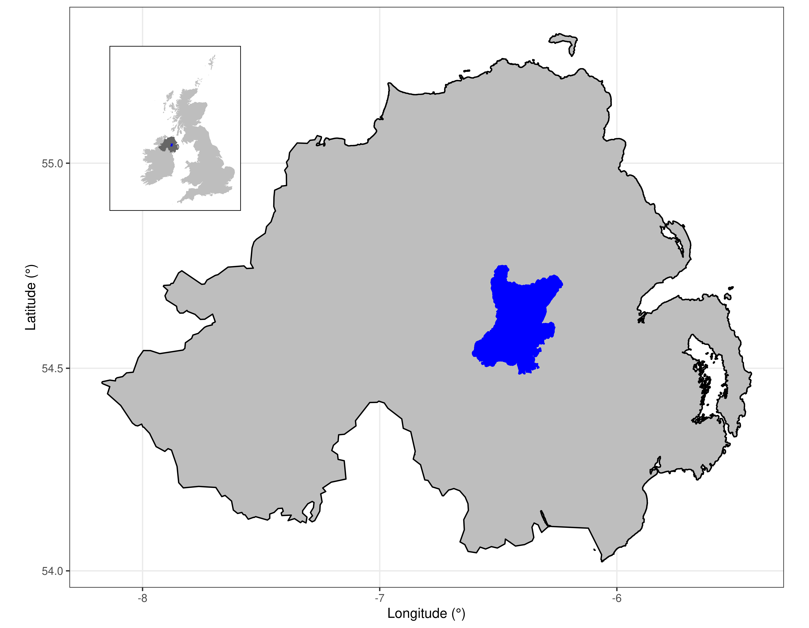

**Fig. 1.** Location of Lough Neagh within Northern Ireland.

## Bathymetry

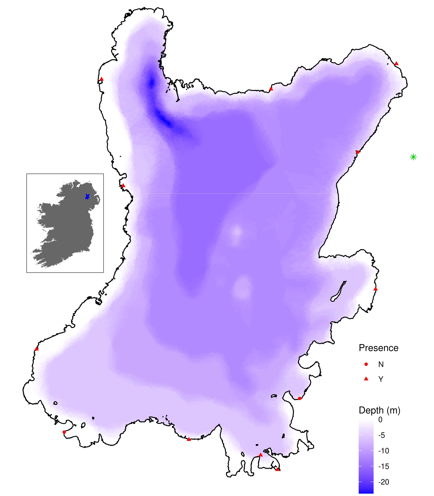
<!-- Add legend of wind station. Add North Arrow and Scale bar. Add river data from DIVA GIS and colour surrounding according to the inlet map. -->

**Fig. 2.** Bathymetric map of Lough Neagh. Sampling locations are highlighted in red. The location of the wind station is shown in green.

## Wind direction and wind speed

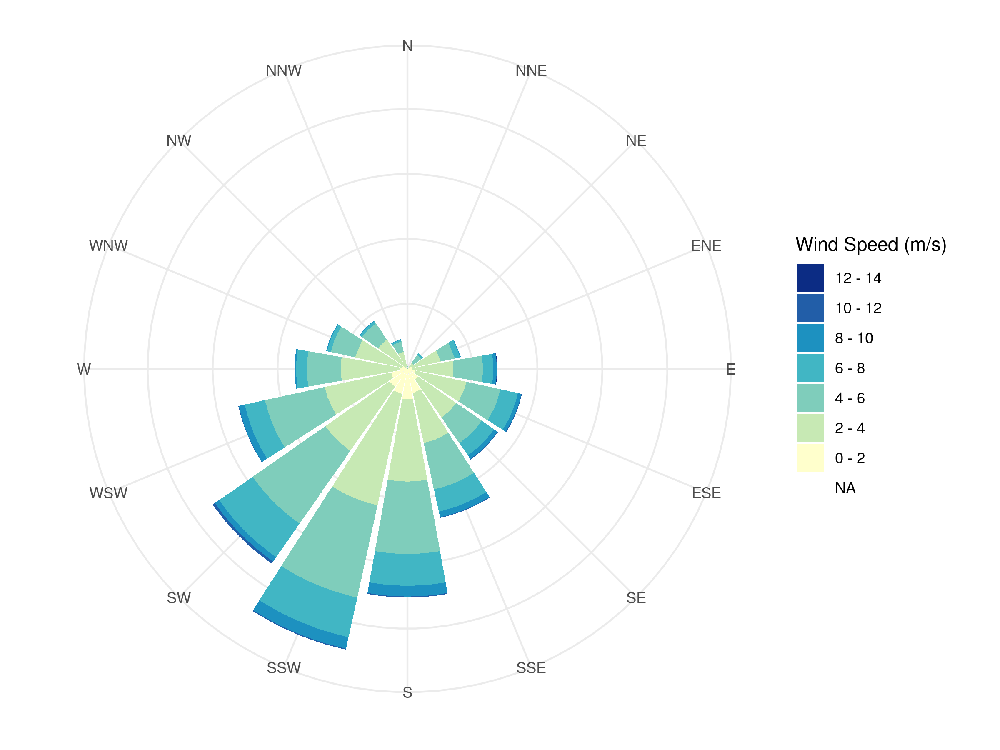

**Fig. 3.** Polar diagram of wind direction and wind speed from 2003 - 2017.

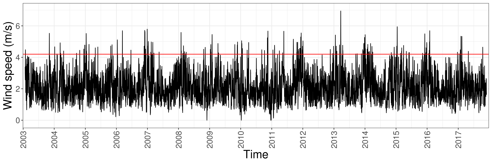

**Fig. 4.** Wind speed over time from 2003 - 2017.

**Table 1.** Mean wind speed and wind direction from 2003 - 2017.

```{r, echo=FALSE, asis=TRUE}
library(dplyr, quiet=TRUE)
load("data/ln_wind_2003_2017.rda")

#' # What is the mean wind speed for every year?
ln_wind_2003_2017 %>% group_by(year) %>% summarise(avg_speed = mean(MEAN_WIND_SPEED, na.rm=TRUE),
                                                   avg_dir = mean(MEAN_WIND_DIR, na.rm=TRUE)) %>%
  knitr::kable(format="markdown", digits=2)
```

## Fetch

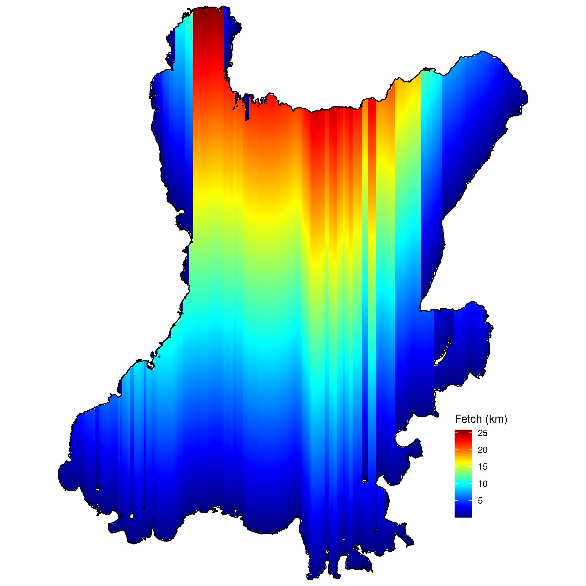

**Fig. 5.** Map of the fetch of the prevailing (mean) wind direction (180°).

## Significant wave height

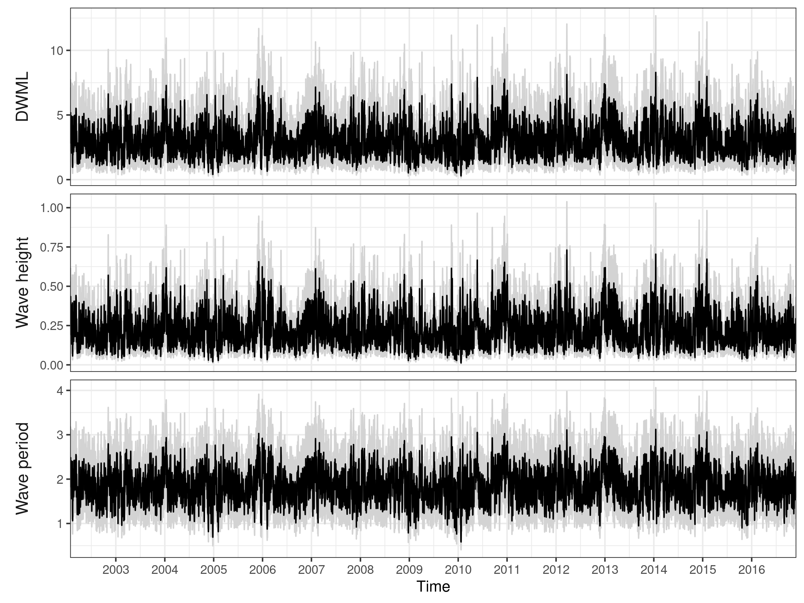

**Fig. 6.** Mean wave height (± SD), mean wave period (± SD) and mean water mixed layer depth (± SD) from 2003 - 2017.

## Cumulative sediment suspension

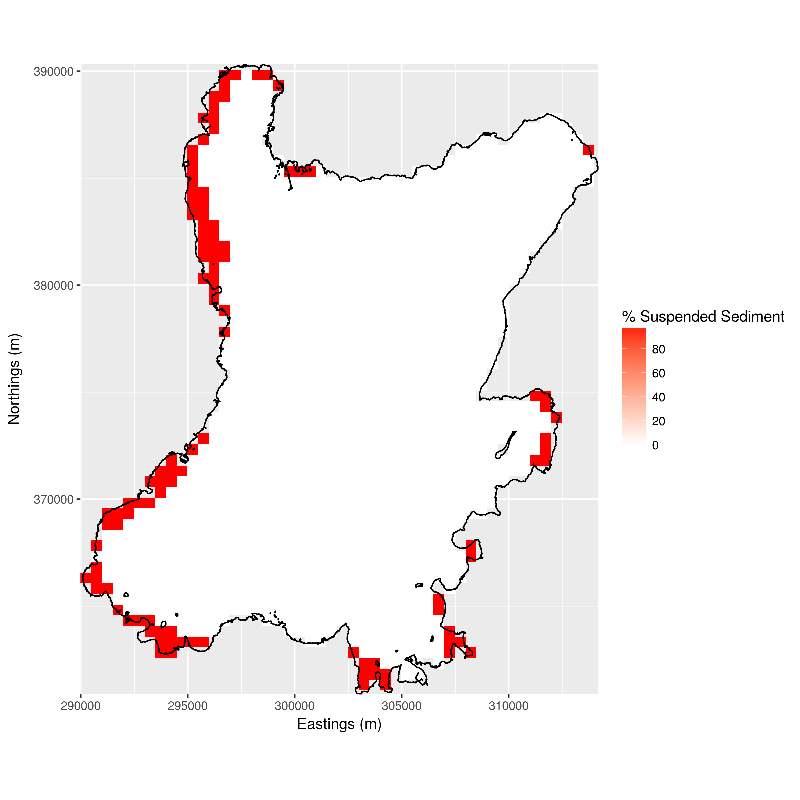

**Fig. 7.** Percentage of time that the entire water column experienced sediment suspension in 2015.

## Suitable substrate

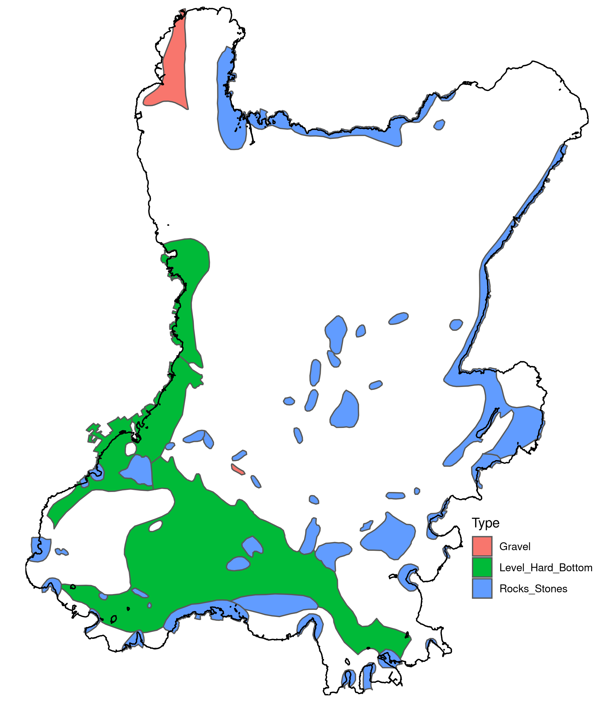

**Fig. 8.** Map of suitable substrate (gravel, hard bottom and rocks/stones) for *D. polymorpha* in Lough Neagh.

## Depth and substrate type

**Table 2** Depth and substrate type for each of the sampling location.

```{r, echo=FALSE, asis=TRUE}
# Read sampling locations file
samplingsites <- readxl::read_xlsx("extdata/ZM_presence_sites.xlsx")
samplingsites <- tidyr::separate(samplingsites, `Co-ordinates`, into=c("y","x"), sep=",")
samplingsites <- tidyr::drop_na(samplingsites)
samplingsites$x <- as.numeric(samplingsites$x)
samplingsites$y <- as.numeric(samplingsites$y)
sp::coordinates(samplingsites) <- ~x+y
raster::projection(samplingsites) <- "+proj=longlat +datum=WGS84 +no_defs +ellps=WGS84 +towgs84=0,0,0"
samplingsites <- sp::spTransform(samplingsites, "+proj=tmerc +lat_0=53.5 +lon_0=-8 +k=1.000035 +x_0=200000 +y_0=250000 +datum=ire65 +units=m +no_defs +ellps=mod_airy +towgs84=482.530,-130.596,564.557,-1.042,-0.214,-0.631,8.15")

# Load bathymetry raster file
load("data/ln_bathy_int.rda")

# Extract bathymetry for sampling locations
depth_sl <- raster::extract(ln_bathy_int, samplingsites, df=T)

substrate_type <- sf::read_sf("extdata/Substrate_types_projective.shp") %>% 
  sf::st_transform(crs="+proj=tmerc +lat_0=53.5 +lon_0=-8 +k=1.000035 +x_0=200000 +y_0=250000 +datum=ire65 +units=m +no_defs +ellps=mod_airy +towgs84=482.530,-130.596,564.557,-1.042,-0.214,-0.631,8.15")

# Extract sediment type of sampling locations
substrate_type <- as(substrate_type, "Spatial")
raster::crs(substrate_type) <- "+proj=tmerc +lat_0=53.5 +lon_0=-8 +k=1.000035 +x_0=200000 +y_0=250000 +datum=ire65 +units=m +no_defs +ellps=mod_airy +towgs84=482.530,-130.596,564.557,-1.042,-0.214,-0.631,8.15"
substrate_sl <- raster::extract(substrate_type, samplingsites, df=T)

# Create table with sampling locations, absence/presence, depth and sediment type!
samplingsites <- cbind(cbind(as.data.frame(samplingsites), depth_sl), substrate_sl) %>% 
  dplyr::select(-c(ID,point.ID, poly.ID,id, Name, Value..mm., x,y))
colnames(samplingsites) <- c("Site name", "Presence", "Adult shells", "Living", "Larvae", "Depth", "Substrate type")
samplingsites$Depth <- abs(round(samplingsites$Depth, digits=2))
knitr::kable(samplingsites, format="markdown")
```

## Relationship between DWML and sedimentation rate

```{r ln_dwml_sed_mean, fig.width=8, fig.height=5}
## Plot linear models and mean linear model
library(dplyr)
df <- data.frame(dwml=seq(1,10,by=0.1), y_nw=33.99*seq(1,10,by=0.1)-125.34, 
                 y_ne=10.05*seq(1,10,by=0.1)-1.19, y_ce=28.36*seq(1,10,by=0.1)-79.18,
                 y_sw=22.78*seq(1,10,by=0.1)-65.44, y_se=16.59*seq(1,10,by=0.1)-15.38)
df$y_mean <- df %>% dplyr::select(-dwml) %>% rowMeans()

library(ggplot2); library(ggpmisc)
ggplot(data=df, aes(x=dwml, y=y_mean)) + geom_line() +
  geom_line(aes(y=y_ne)) + geom_line(aes(y=y_ce)) + 
  geom_line(aes(y=y_sw)) + geom_line(aes(y=y_se)) + 
  geom_line(aes(y=y_nw), col="red") + theme_bw() + 
  stat_poly_eq(aes(label =  paste(..eq.label.., sep = "~~~~")),
               formula = y ~ x, parse = TRUE) + 
  labs(x="DWML (m)", y="Total sedimentation rate (g/m2)")
```

**Fig. 9.** Relationship between water mixed layer depth (DWML) and total sedimentation rate. Black lines show the different linear models extracted from Douglas & Rippey 2000, red line shows the mean of the 5 different linear models.

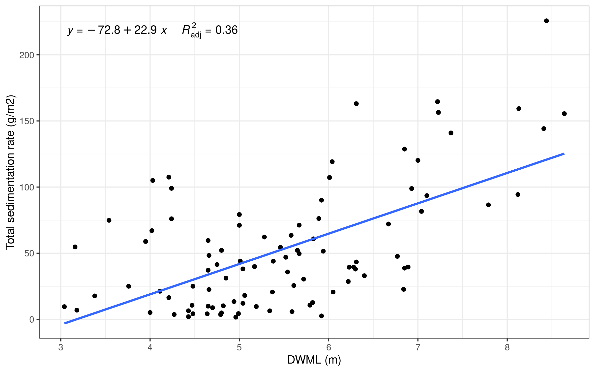
**Fig. 10.** Original relationship between water mixed layer depth (DWML) and total sedimentation rate according to Douglas & Rippey 2000.

## Sedimentation rate

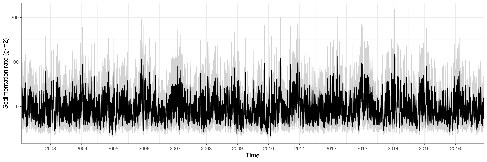

**Fig. 11.** Mean sedimentation rate (g/m2) (± SD) over time (2003 - 2017).

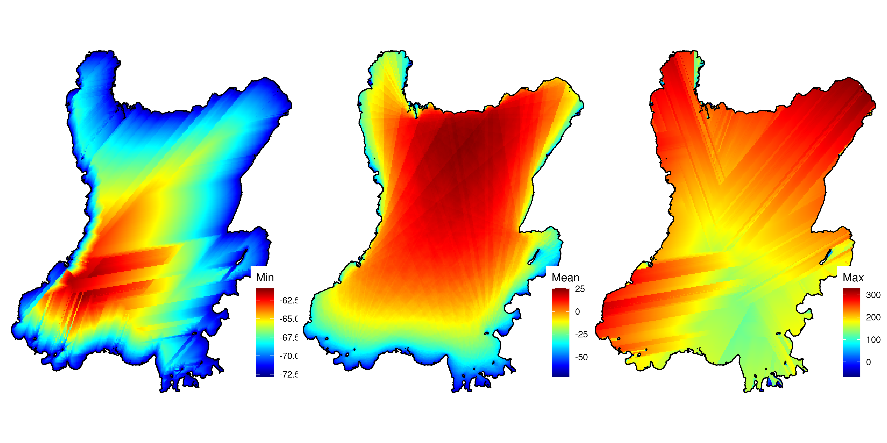
**Fig. 12.** Map of minimum, mean and maximum sedimentation rate (g/m2) of all years (2003 - 2017).

## Total sedimentation (mg/l)

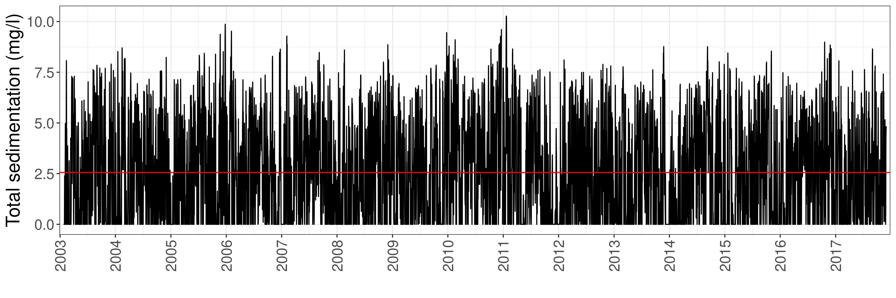

**Fig. 13.** Mean total sedimentation (mg/l) over time (2003 - 2017).

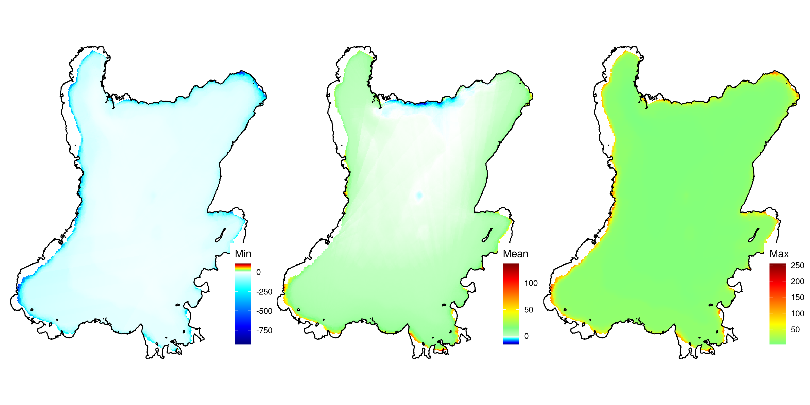
**Fig. 14.** Map of minimum, mean and maximum total sedimentation (mg/l) of all years (2003 - 2017).

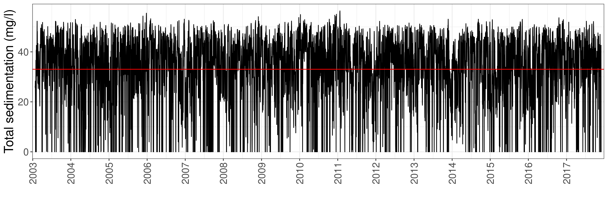

**Fig. 15.** Mean total sedimentation (mg/l) for Kinnegon Bay over time (2003 - 2017).

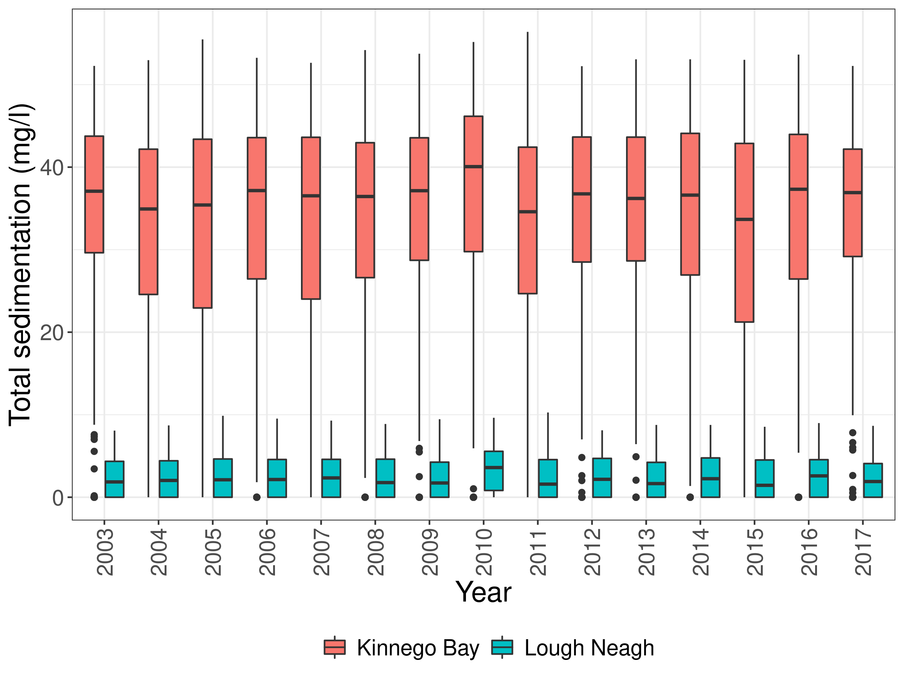
**Fig. 16.** Comparison of yearly total sedimentation (mg/l) for Kinnegon Bay versus the entire Lough.

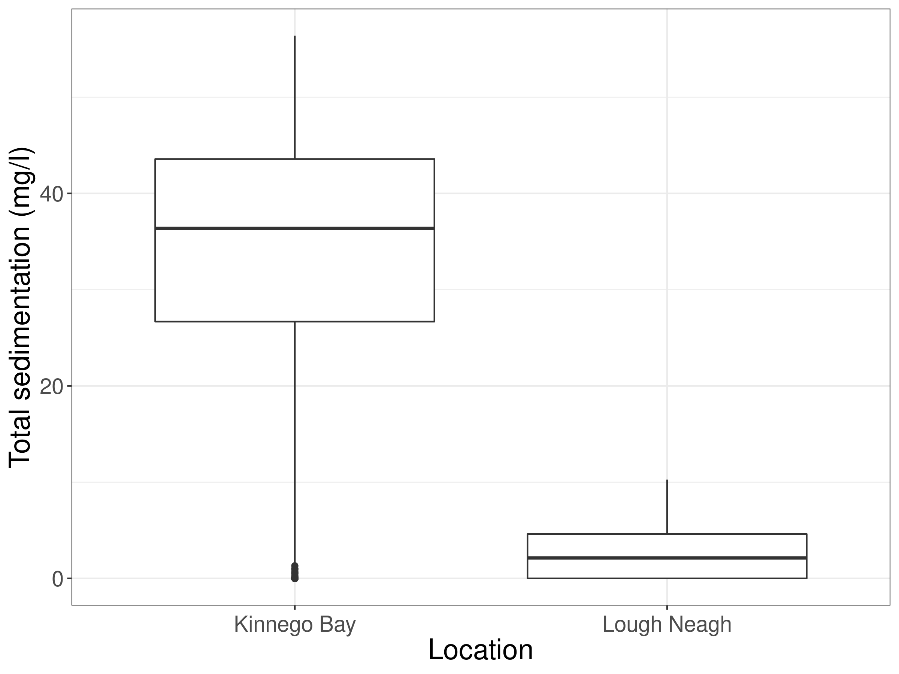

**Fig. 17.** Comparison of total sedimentation from Kinnego Bay versus the entire Lough.

## References

Douglas and Rippey 2000 - The random redistribution of sediment by wind in a lake

## Supplementary Figures

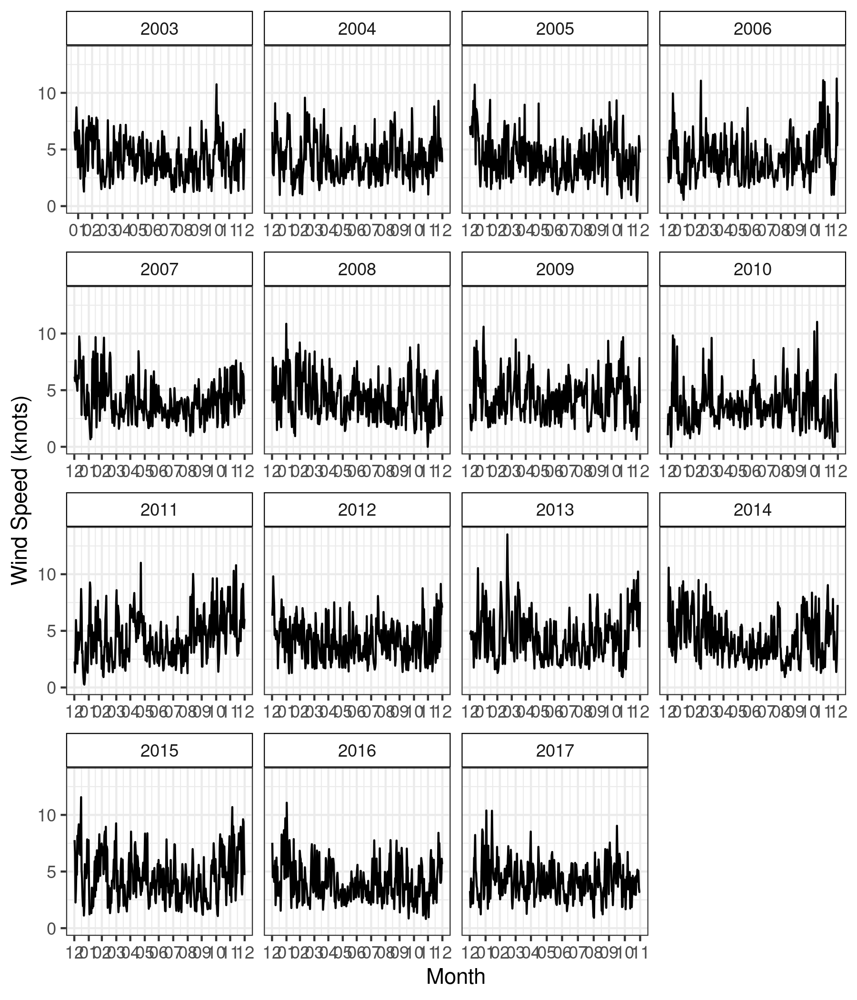

**Fig. S1.** Yearly wind speed from 2003 - 2017.

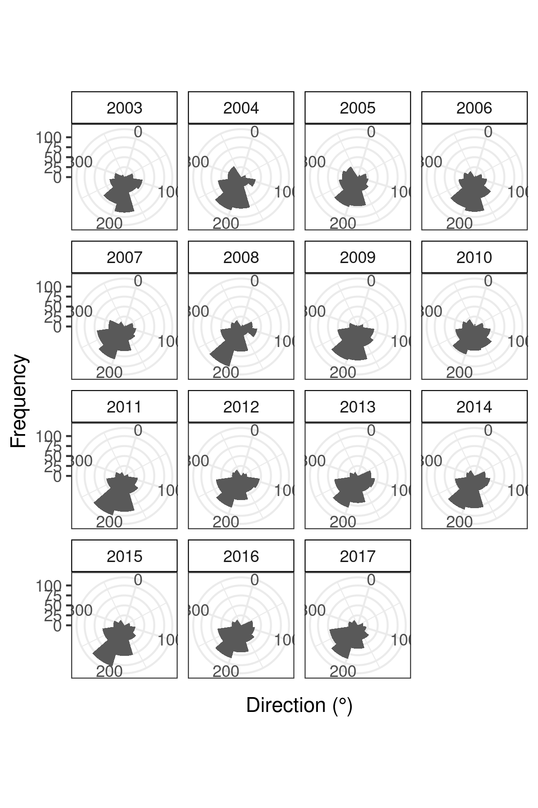

**Fig. S2.** Yearly wind speed from 2003 - 2017.

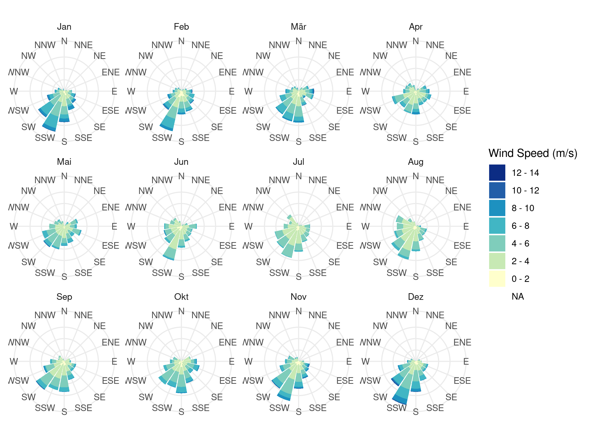

**Fig. S3.** Monthly polar diagram of wind direction and wind speed from 2003 - 2017.

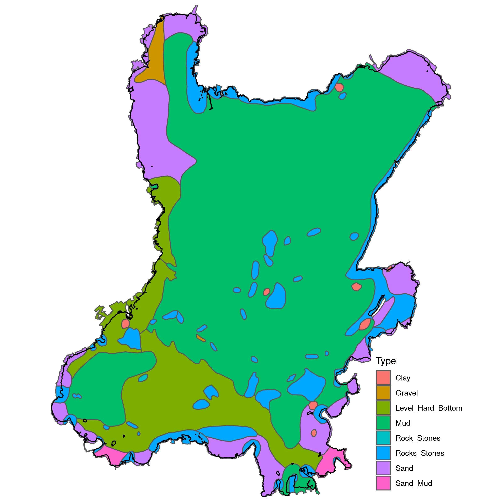

**Fig. S4.** Map of substrate types in Lough Neagh.

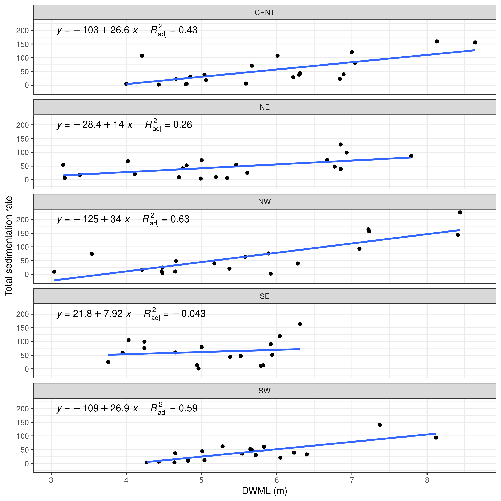

**Fig. S5.** Linear relationship between DWML and total sedimentation rate separated by locations, adapted from Douglas & Rippey 2000.

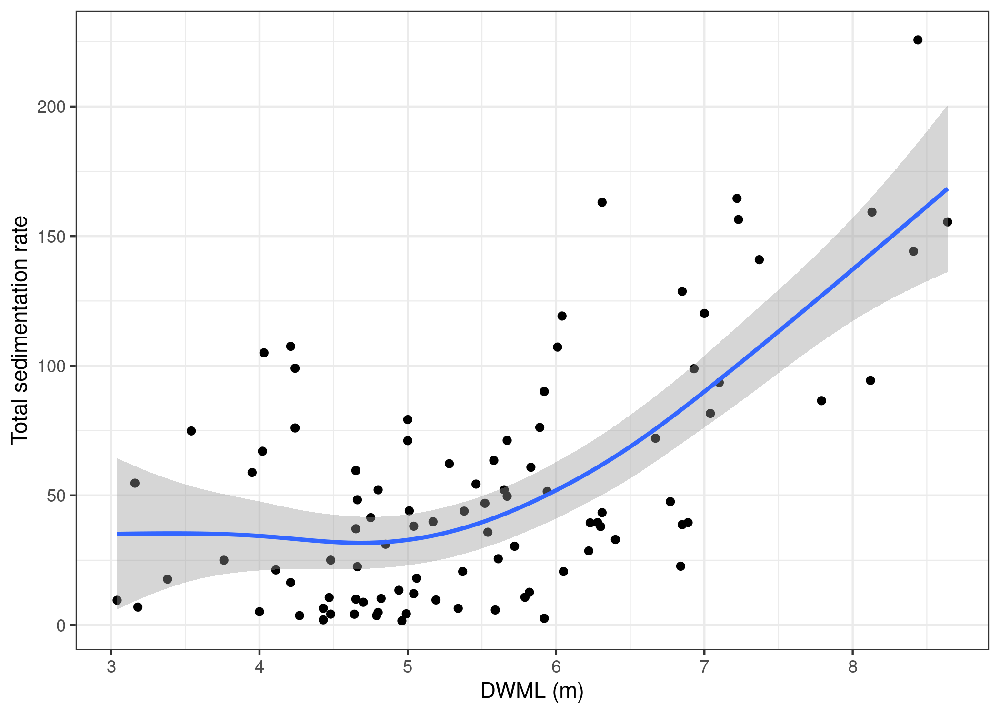
**Fig. S6.** Non-linear relationship between DWML and total sedimentation rate separated by locations. Data derived from Douglas & Rippey 2000.
