Analysing the temporal dynamics in environmental conditions of Lough
Neagh, Northern Ireland
================
RS-eco

## Aim

To understand the wind driven patterns of sediment suspension in Lough
Neagh, Northern Ireland

## Methodology

  - Use hourly/daily wind speed and wind direction data from
    Aldergrove/Belfast International Airport from 2003 to 2017 to
    calculate wind driven currents within Lough Neagh

  - Use estimated wind driven currents to estimate the suspended
    sediment levels within the Lough.

<!--
Wave Generation Calculator https://swellbeat.com/wave-calculator/
Output examples https://soundwaves.usgs.gov/2012/04/research3.html 

Data input for Lough Neagh model

Wind driven energy
Wind speed and direction
http://www.metoffice.gov.uk/public/weather/climate/gcewfr7bf 
http://www.metoffice.gov.uk/datapoint/getting-started
http://www.metoffice.gov.uk/datapoint/support/api-reference 
http://www.metoffice.gov.uk/datapoint/product/uk-hourly-site-specific-observations/detailed-documentation#UK observations capabilities feed 

Location Aldergrove http://www.metoffice.gov.uk/datapoint/support/documentation/uk-locations-site-list-detailed-documentation 
<Location elevation="63.0" id="3917" latitude="54.664" longitude="-6.224" name="Belfast International Airport" region="ni" unitaryAuthArea="County Antrim"/>

http://datapoint.metoffice.gov.uk/public/data/val/wxobs/all/xml/3917?res=hourly&time=2000-01-01T18Z&key=baadf8a4-1243-4e22-b4bc-a4a99cfe9b49

http://catalogue.ceda.ac.uk/uuid/916ac4bbc46f7685ae9a5e10451bae7c 

Influence of River Flow rates on currents in LN
Major tributaries – National River flow archive downloadable datasets
Upper Bann at Dynes Bridge - http://nrfa.ceh.ac.uk/data/station/meanflow/203017

Blackwater at Maydown Bridge - http://nrfa.ceh.ac.uk/data/station/meanflow/203010 
Ballinderry at Ballinderry Bridge - http://nrfa.ceh.ac.uk/data/station/meanflow/203012 
Moyola at Moyola New Bridge - http://nrfa.ceh.ac.uk/data/station/meanflow/203020 
Main at Shane's Viaduct - http://nrfa.ceh.ac.uk/data/station/meanflow/203093 
Six-Mile Water at Antrim - http://nrfa.ceh.ac.uk/data/station/meanflow/203018 

Minor tributaries
Glenavy at Glenavy - http://nrfa.ceh.ac.uk/data/station/meanflow/203026 
Crumlin at Cidercourt Bridge - http://nrfa.ceh.ac.uk/data/station/info?203040

Lough outflow
Lower Bann at Movanagher - http://nrfa.ceh.ac.uk/data/station/meanflow/203040 

Lake water height
Bathymetry/sediments summary for Lough Neagh
http://roseenergy.webbelief.com/Content/planning_4_WbEditorID_1/Lough%20Neagh%20Desktop%20Review,%20August%2007.pdf 
Lough Neagh daily depth data - http://www.dardni.gov.uk/index/rivers/lough-levels/lough-neagh-levels.htm

Importance of site http://www.doeni.gov.uk/niea/ramsar/ramsar_loughneagh.shtml 
-->

## Study area

**Fig. 1.** Location of Lough Neagh within Northern Ireland.

## Bathymetry

<!-- Add legend of wind station. Add North Arrow and Scale bar. Add river data from DIVA GIS and colour surrounding according to the inlet map. -->

**Fig. 2.** Bathymetric map of Lough Neagh. Sampling locations are
highlighted in red. The location of the wind station is shown in green.

## Wind direction and wind speed

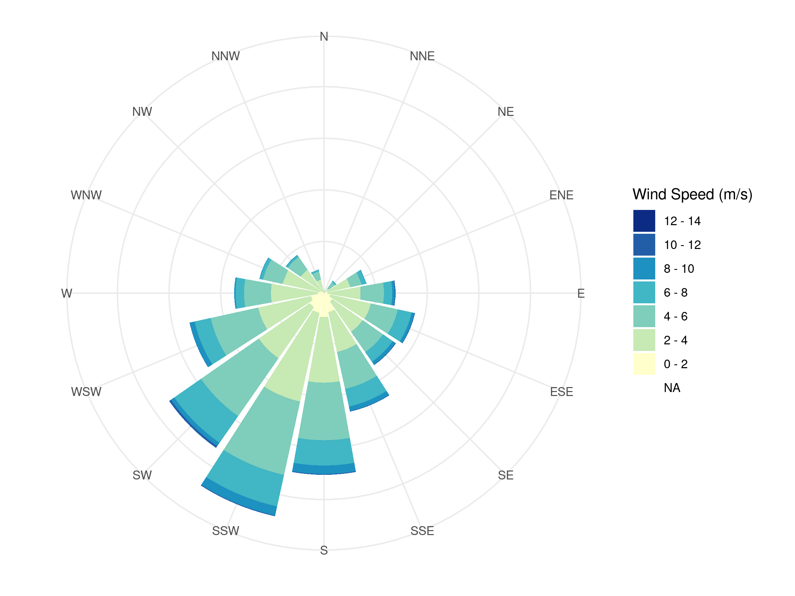

**Fig. 3.** Polar diagram of wind direction and wind speed from 2003 -
2017.

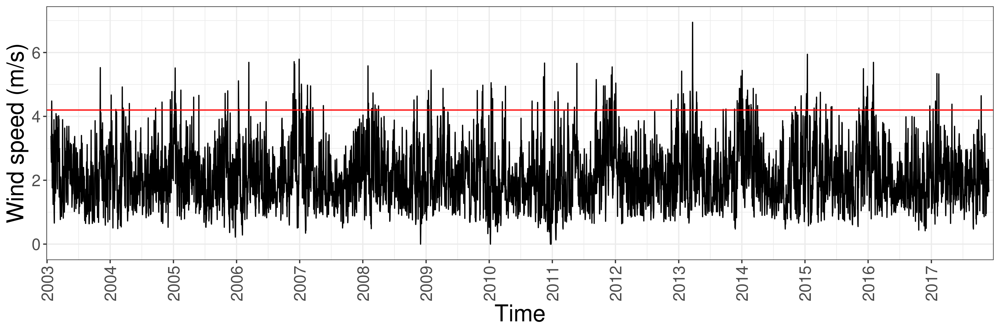

**Fig. 4.** Wind speed over time from 2003 - 2017.

**Table 1.** Mean wind speed and wind direction from 2003 - 2017.

| year | avg\_speed | avg\_dir |
| ---: | ---------: | -------: |
| 2003 |       8.15 |   184.17 |
| 2004 |       8.15 |   209.59 |
| 2005 |       8.23 |   203.71 |
| 2006 |       8.25 |   192.14 |
| 2007 |       7.97 |   203.07 |
| 2008 |       8.32 |   194.62 |
| 2009 |       8.38 |   188.85 |
| 2010 |       6.92 |   189.52 |
| 2011 |       8.61 |   196.65 |
| 2012 |       7.96 |   193.67 |
| 2013 |       8.62 |   187.27 |
| 2014 |       8.30 |   191.19 |
| 2015 |       8.75 |   202.21 |
| 2016 |       7.82 |   193.57 |
| 2017 |       8.10 |   205.27 |

## Fetch

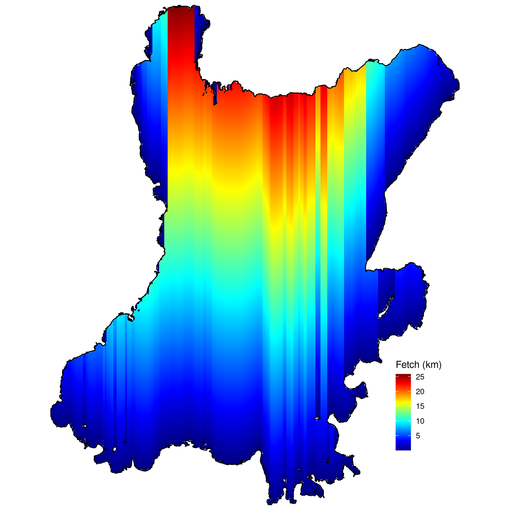

**Fig. 5.** Map of the fetch of the prevailing (mean) wind direction
(180°).

## Significant wave height

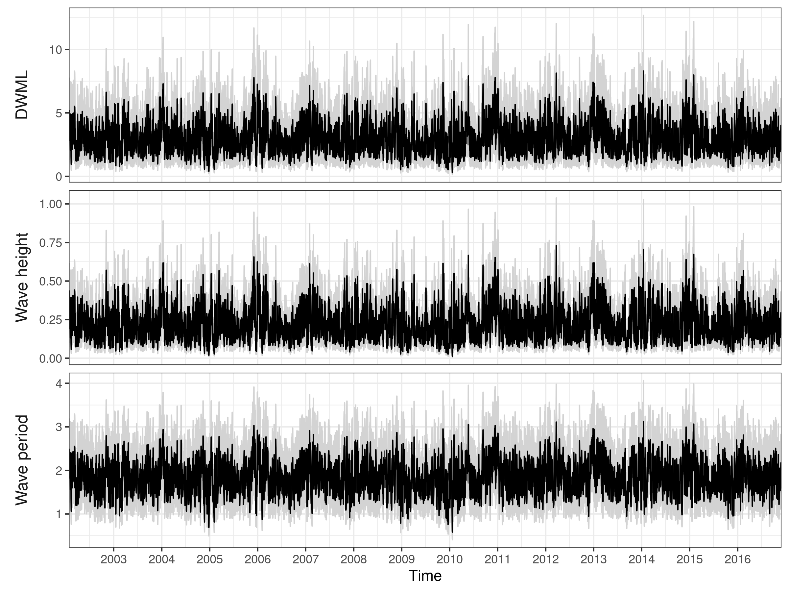

**Fig. 6.** Mean wave height (± SD), mean wave period (± SD) and mean
water mixed layer depth (± SD) from 2003 - 2017.

## Cumulative sediment suspension

**Fig. 7.** Percentage of time that the entire water column experienced
sediment suspension in 2015.

## Suitable substrate

**Fig. 8.** Map of suitable substrate (gravel, hard bottom and
rocks/stones) for *D. polymorpha* in Lough Neagh.

## Depth and substrate type

**Table 2** Depth and substrate type for each of the sampling
location.

| Site name                         | Presence | Adult shells | Living | Larvae | Depth | Substrate type      |
| :-------------------------------- | :------- | :----------- | :----- | :----- | ----: | :------------------ |
| Kinnego\_Marina                   | Y        | Y            | Y      | Y      |    NA | NA                  |
| Kinnego\_Point (Discovery Centre) | Y        | Y            | Y      | Y      |  4.45 | Mud                 |
| Bayshore (Ardmore Rd.)            | Y        | N            | Y      | Y      |    NA | Sand                |
| Maghery Country Park              | N        | N            | N      | N      |    NA | Rocks\_Stones       |
| Brocagh                           | Y        | N            | N      | Y      |  0.00 | Sand                |
| Kinturk\_Point (Curran Quay)      | Y        | N            | N      | Y      |    NA | Level\_Hard\_Bottom |
| Ballyronan\_Marina\_Point         | Y        | Y            | N      | N      |  0.00 | Sand                |
| Toomebridge                       | Y        | N            | Y      | N      |    NA | NA                  |
| Cranfield Rd.                     | Y        | N            | Y      | N      |  2.05 | Rocks\_Stones       |
| Antrim\_Shore\_Park               | Y        | Y            | N      | Y      |    NA | NA                  |
| Northstone\_Materials             | N        | N            | N      | N      |    NA | NA                  |
| Fisherman’s\_Quay                 | Y        | N            | Y      | Y      |    NA | Rocks\_Stones       |
| Bartins\_Bay                      | N        | N            | N      | N      |  2.56 | Sand                |

## Relationship between DWML and sedimentation rate

<!-- -->

**Fig. 9.** Relationship between water mixed layer depth (DWML) and
total sedimentation rate. Black lines show the different linear models
extracted from Douglas & Rippey 2000, red line shows the mean of the 5
different linear models.

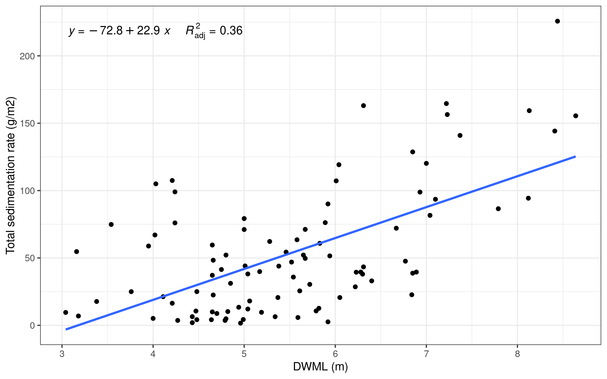 **Fig. 10.** Original relationship
between water mixed layer depth (DWML) and total sedimentation rate
according to Douglas & Rippey 2000.

## Sedimentation rate

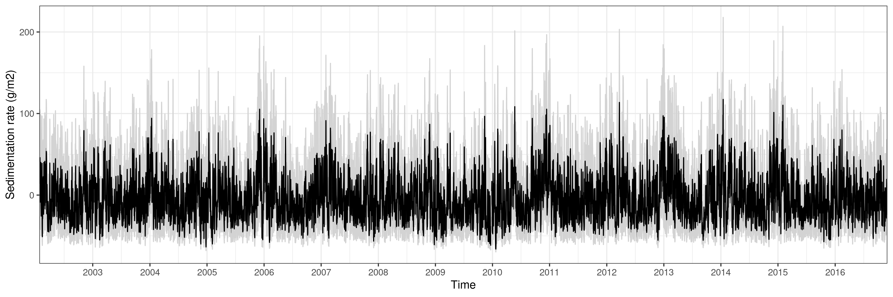

**Fig. 11.** Mean sedimentation rate (g/m2) (± SD) over time (2003 -
2017).

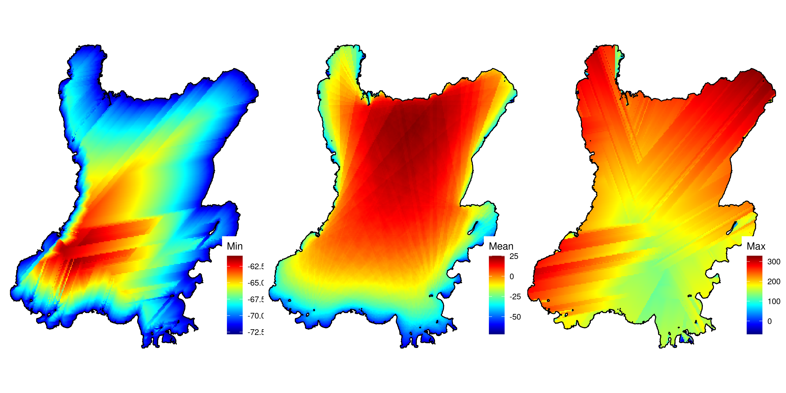 **Fig. 12.** Map of minimum, mean and
maximum sedimentation rate (g/m2) of all years (2003 - 2017).

## Total sedimentation (mg/l)

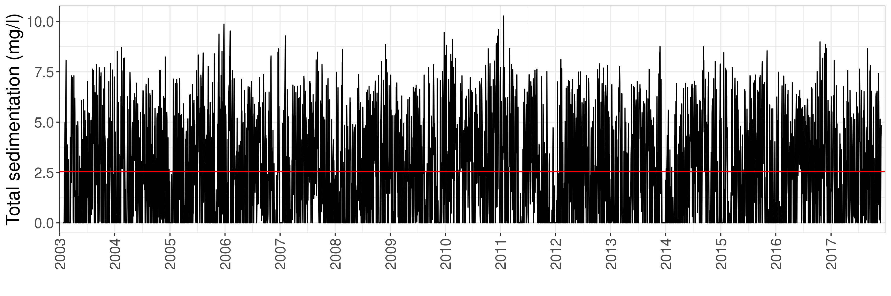

**Fig. 13.** Mean total sedimentation (mg/l) over time (2003 - 2017).

 **Fig. 14.** Map of minimum, mean and
maximum total sedimentation (mg/l) of all years (2003 - 2017).

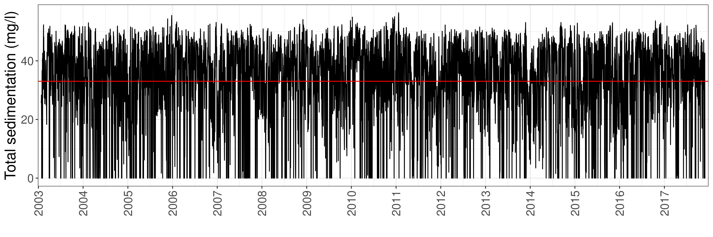

**Fig. 15.** Mean total sedimentation (mg/l) for Kinnegon Bay over time
(2003 - 2017).

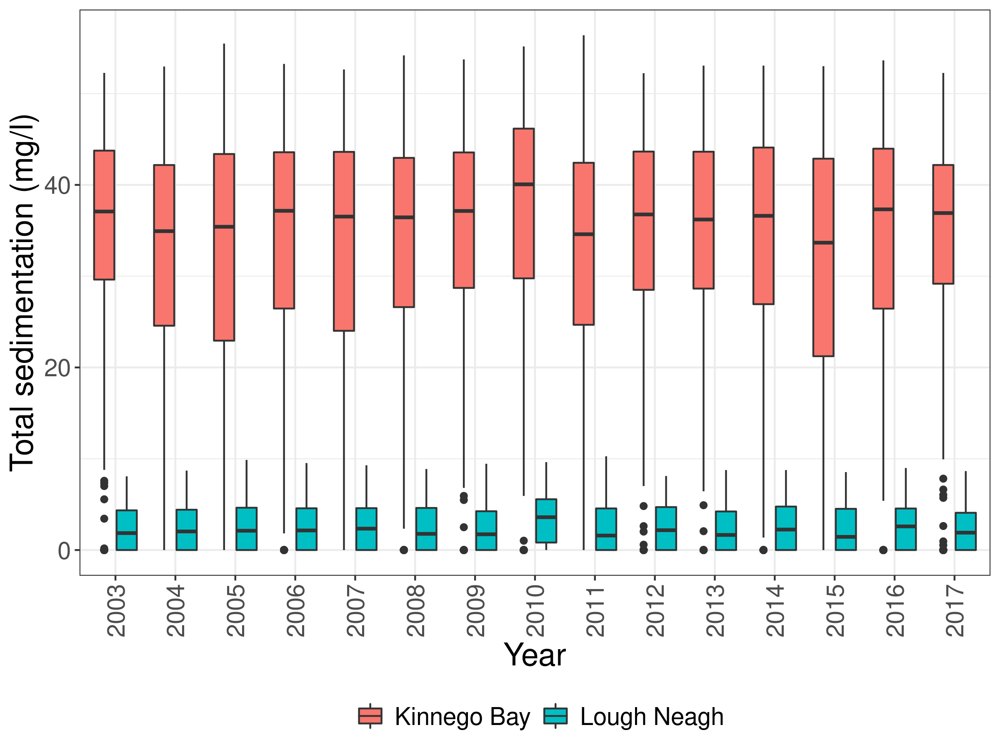 **Fig. 16.** Comparison of yearly
total sedimentation (mg/l) for Kinnegon Bay versus the entire Lough.

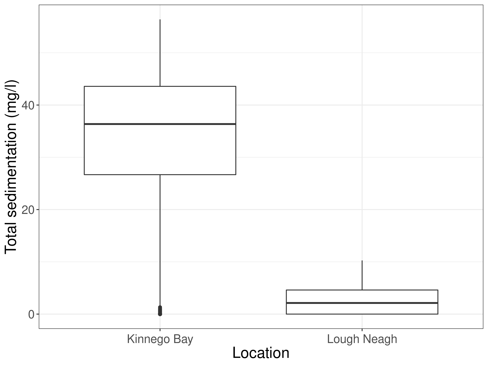

**Fig. 17.** Comparison of total sedimentation from Kinnego Bay versus
the entire Lough.

## References

Douglas and Rippey 2000 - The random redistribution of sediment by wind
in a lake

## Supplementary Figures

**Fig. S1.** Yearly wind speed from 2003 - 2017.

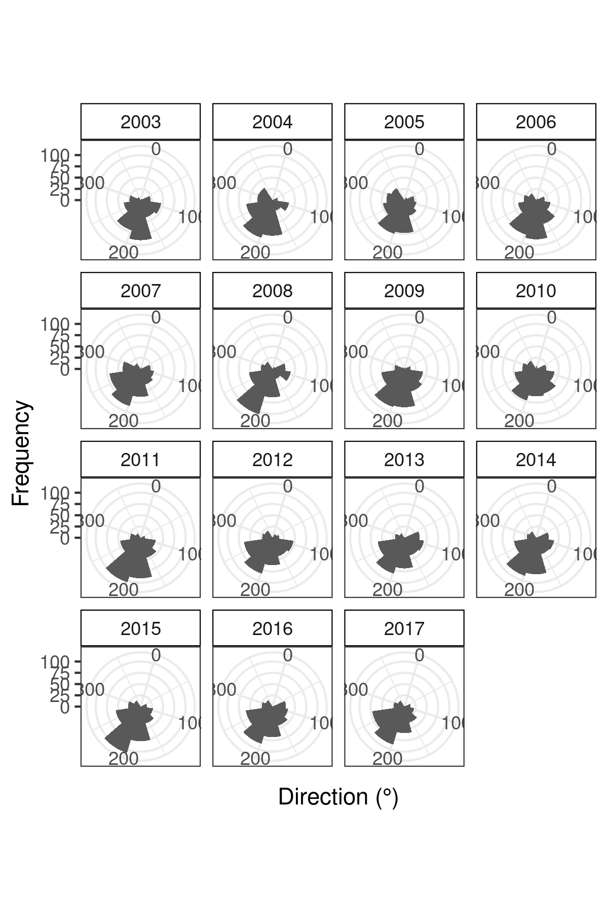

**Fig. S2.** Yearly wind speed from 2003 - 2017.

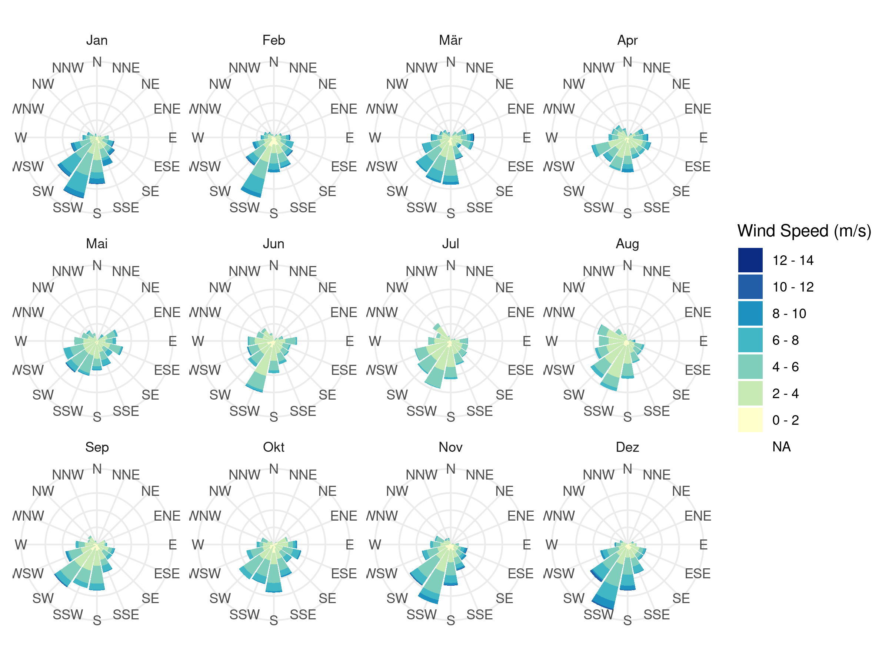

**Fig. S3.** Monthly polar diagram of wind direction and wind speed from
2003 - 2017.

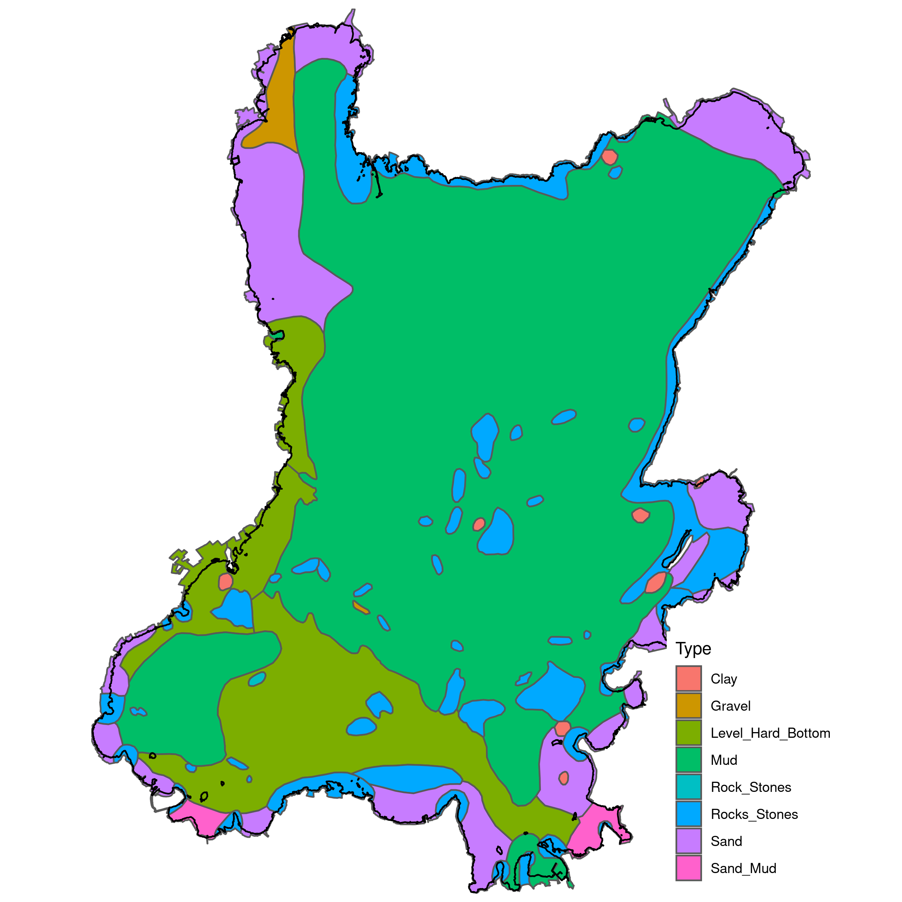

**Fig. S4.** Map of substrate types in Lough Neagh.

**Fig. S5.** Linear relationship between DWML and total sedimentation
rate separated by locations, adapted from Douglas & Rippey 2000.

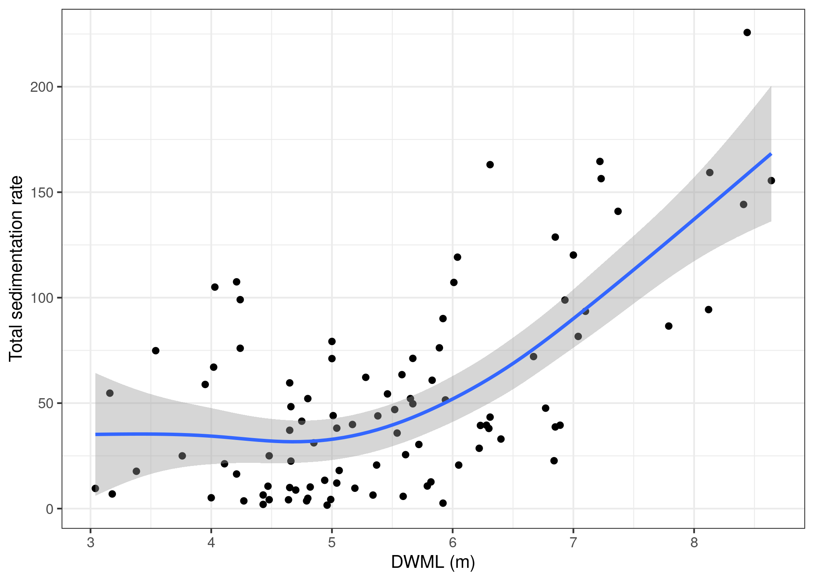 **Fig. S6.** Non-linear relationship
between DWML and total sedimentation rate separated by locations. Data
derived from Douglas & Rippey 2000.
